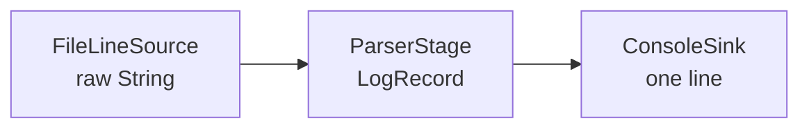

# Mimari

İkinci aşamada pipeline artık ham dizgiler yerine alan modeli taşır. Source ham satırları üretir, ParserStage bunları `LogRecord` değerlerine dönüştürür ve sink kayıtları tüketir.

`Pipeline` aşamaları bir liste olarak saklar ve source ile sink arasındaki bağlantıyı kurar. `Main` yalnızca komut satırı parametresini okur, bileşenleri bir araya getirir, çalıştırır ve atlanan kayıt sayısını gösterir.

`LogRecord` immutable tutulur. `attributes` haritası sonraki haftalarda parser'ın ilk aşamada bilmediği alanları eklemek için genişleme noktasıdır. Parser hatalı satırları bu hafta yalnızca atlar ve sayar; hataların ayrıntılı yönetimi sonraki aşamalara bırakılmıştır.

ParserStage testleri dosya okumaz. Her test doğrudan bir satır verir ve çıktıları collecting emitter ile toplar. Böylece parser'ın mantığı dosya sisteminden ayrılır ve testler hızlı, tekrarlanabilir olur.

`Emitter` soyutlaması kullanılmıştır; çünkü ilerleyen aşamalarda tek bir giriş sıfır, bir veya birden fazla çıktı üretebilir. Bir aşamadan tek bir değer döndürmek gereksiz bir bire bir ilişki oluştururdu.
