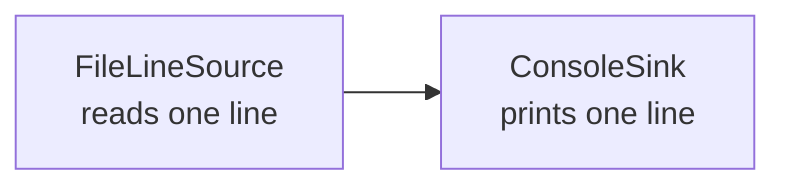

# Mimari

İlk aşamada bilinçli olarak küçük bir pipeline kurulmuştur. Source verileri üretir, pipeline bileşenleri birbirine bağlar ve sink verileri tüketir.

`Pipeline` iki bileşen arasındaki bağlantıyı kurar. `Main` yalnızca komut satırı parametresini okur, bileşenleri bir araya getirir ve `run()` metodunu çağırır.

`Emitter` soyutlaması kullanılmıştır; çünkü ilerleyen aşamalarda tek bir giriş sıfır, bir veya birden fazla çıktı üretebilir. Bir aşamadan tek bir değer döndürmek gereksiz bir bire bir ilişki oluştururdu.
